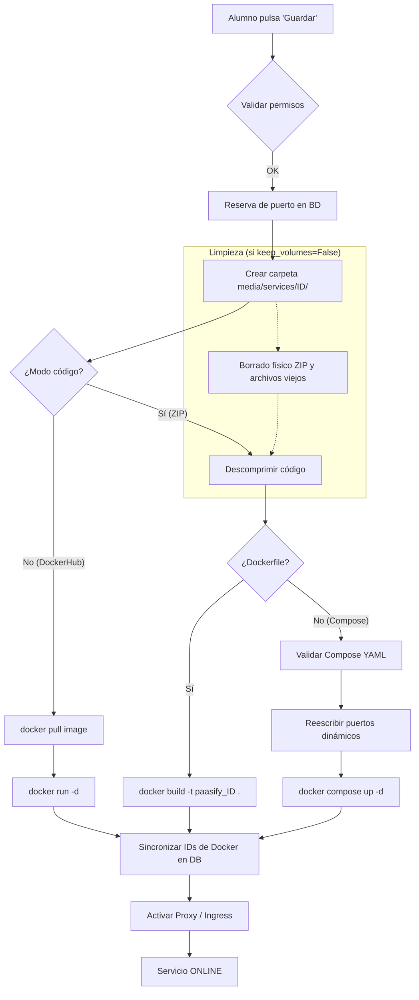
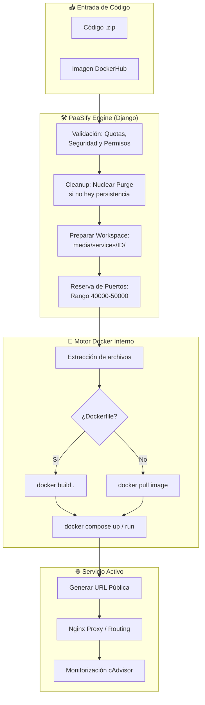
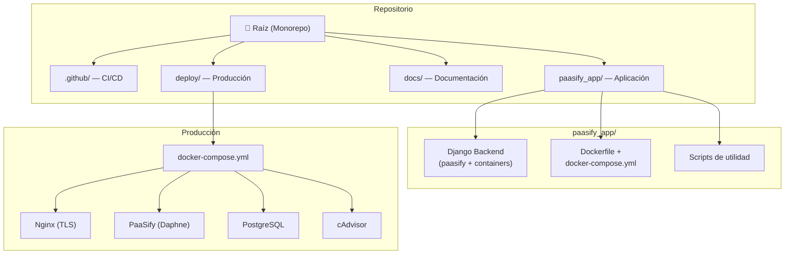
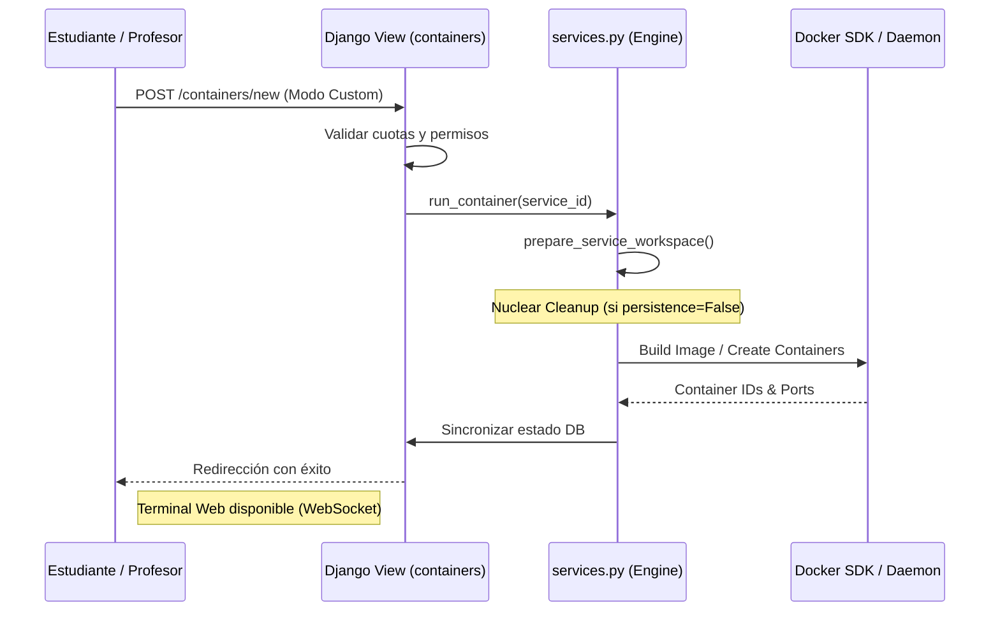

<p align="center">
  
</p>

<h1 align="center">PaaSify</h1>

<p align="center">
  <strong>Plataforma como Servicio (PaaS) educativa para despliegue de contenedores Docker</strong>
</p>

<p align="center">
  <a href="#-quickstart"></a>
  
  
  
  
</p>

---

## 🎯 ¿Qué es PaaSify?

**PaaSify** es una plataforma web que permite a **estudiantes universitarios** desplegar, gestionar y monitorizar aplicaciones en **contenedores Docker** desde una interfaz gráfica intuitiva — sin necesidad de acceder a servidores ni usar línea de comandos.

Diseñada para facilitar el aprendizaje de tecnologías de virtualización y despliegue en asignaturas de informática.

### Características Principales

| Característica                  | Descripción                                                                       |
| ------------------------------- | --------------------------------------------------------------------------------- |
| 🐳 **4 modos de despliegue**    | Catálogo oficial, DockerHub, Dockerfile personalizado y Docker Compose            |
| 📚 **Gestión académica**        | Asignaturas, proyectos y roles (Admin, Profesor, Alumno)                          |
| 💻 **Terminal web interactiva** | Ejecuta comandos en contenedores desde el navegador (xterm.js + WebSocket)        |
| 🔄 **Interfaz reactiva**        | Actualización en tiempo real con HTMX (sin recargar página)                       |
| 🔐 **Seguridad integrada**      | Validación estricta de Compose (bloqueo de privileged, bind mounts, network_mode) |
| 🌐 **API REST completa**        | Autenticación JWT, documentación Swagger/OpenAPI, CI/CD compatible                |
| 📊 **Monitorización**           | Panel cAdvisor integrado para supervisar CPU, RAM y red por contenedor            |

---

## 🚀 Quickstart

### Opción A: Despliegue con Docker (recomendado — 3 min)

> **Requisitos:** Docker y Docker Compose en el servidor. **No necesita Python.**

```bash
# 1. Descargar solo la carpeta de configuración de despliegue
mkdir PaaSify && cd PaaSify
git clone --no-checkout --sparse https://github.com/DavidRG25/TFG_APP_DOCKER-PASSIFY.git .
git sparse-checkout set deploy
git checkout main

# 2. Configurar variables de entorno
cd deploy
cp .env.example .env
nano .env  # Configura DJANGO_SECRET_KEY, ADMIN_PASSWORD, credenciales BD...

# 3. Levantar todo el ecosistema
docker compose up -d

# 4. Inicializar datos (solo la primera vez)
docker compose exec paasify python manage.py create_demo_users
docker compose exec paasify python manage.py populate_example_images

# 🎉 Accede a https://tu-dominio
```

| Rol         | Usuario    | Contraseña                                                            |
| ----------- | ---------- | --------------------------------------------------------------------- |
| 🔧 Admin    | `admin`    | La definida en `ADMIN_PASSWORD` del `.env` (por defecto: `Admin!123`) |
| 👨‍🏫 Profesor | `profesor` | `Profesor!2025`                                                       |
| 🎓 Alumno   | `alumno`   | `Alumno!2025`                                                         |

> 📖 Guía completa de despliegue: [docs/DEPLOYMENT.md](docs/DEPLOYMENT.md)

### Opción B: Desarrollo Local

> **Requisitos:** Python 3.10+, Docker Desktop ejecutándose, Git.

```bash
# 1. Clonar el repositorio completo
git clone https://github.com/DavidRG25/TFG_APP_DOCKER-PASSIFY.git
cd TFG_APP_DOCKER-PASSIFY/paasify_app

# 2. Inicialización completa (venv, dependencias, BD, usuarios demo)
bash start.sh

# 🎉 Abre http://localhost:8000
```

> 📖 Guía de desarrollo: [docs/DEVELOPMENT.md](docs/DEVELOPMENT.md)

---

## 📁 Estructura del Repositorio

```
TFG_APP_DOCKER-PASSIFY/
│
├── .github/workflows/      # CI/CD (GitHub Actions)
├── deploy/                  # Configuración de producción (docker-compose, nginx, TLS)
├── docs/                    # 📖 Documentación oficial del proyecto
│   ├── DEPLOYMENT.md        #   → Guía de despliegue y administración
│   ├── DEVELOPMENT.md       #   → Guía de desarrollo (arquitectura, stack, API)
│   ├── USER_GUIDE.md        #   → Guía de usuario (alumnos, profesores, admin)
│   └── assets/              #   → Recursos (logo, imágenes)
│
├── paasify_app/             # 🐍 Código fuente de la aplicación
│   ├── app_passify/         #   → Settings y configuración Django
│   ├── paasify/             #   → App académica (usuarios, asignaturas, proyectos)
│   ├── containers/          #   → App de contenedores (servicios Docker, API, terminal)
│   ├── templates/           #   → Templates HTML (Django + HTMX + Bootstrap)
│   ├── scripts/             #   → Scripts de utilidad (run, start, build_and_push)
│   ├── Dockerfile           #   → Imagen de producción
│   ├── manage.py            #   → CLI Django
│   └── requirements.txt     #   → Dependencias Python
│
├── .gitignore               # Reglas de exclusión globales
└── README.md                # ← Estás aquí
```

---

## 5. Flujo de Despliegue de un Servicio (Deep Dive)

Este diagrama detalla la lógica interna desde que se recibe el código hasta que el servicio está activo:



### Detalle de modos de despliegue

---

## 🔄 Flujo de Trabajo y Jerarquía

PaaSify organiza los recursos de forma jerárquica para facilitar el entorno docente:

```mermaid
flowchart LR
    subgraph Admin ["👨‍💼 Administración"]
        A1[Crear Asignaturas] --> A2[Asignar Profesores]
    end

    subgraph Professor ["👨‍🏫 Rol Profesor"]
        A2 --> P1[Configurar Asignatura]
        P1 --> P2[Crear Proyectos/Plazas]
        P2 --> P3[Matricular Alumnos]
    end

    subgraph Student ["🎓 Rol Alumno"]
        P3 --> S1[Acceder a Proyecto]
        S1 --> S2[Configurar Despliegue]
        S2 --> S3{¿Qué subir?}
        S3 -- "ZIP/Archivo" --> S4[Subir Código]
        S3 -- "DockerHub" --> S5[Indicar Imagen]
        S4 & S5 --> S6[Lanzar Servicio]
    end

    subgraph Docker ["🐳 Infraestructura"]
        S6 --> D1[PaaSify Engine]
        D1 --> D2[Build/Pull Image]
        D2 --> D3[Levantar Contenedor]
        D3 --> D4[Asignar Puerto Web]
    end
```



### 🛠 Lógica Interna del Despliegue (Docker Flow)

Cuando un alumno sube código, PaaSify ejecuta la siguiente lógica interna para garantizar seguridad y aislamiento:



---

## Resumen de la Arquitectura

### 🏗 Estructura del Proyecto



### 📲 Flujo de Comunicación (Lógica Interna)

Este diagrama detalla cómo se procesa una petición de despliegue desde la interfaz hasta el motor de Docker:



---

## 📖 Documentación

| Documento                       | Para quién                                  | Enlace                                     |
| ------------------------------- | ------------------------------------------- | ------------------------------------------ |
| **Despliegue y Administración** | Sysadmins, profesores que administran la VM | [docs/DEPLOYMENT.md](docs/DEPLOYMENT.md)   |
| **Desarrollo**                  | Desarrolladores que contribuyen al código   | [docs/DEVELOPMENT.md](docs/DEVELOPMENT.md) |
| **Guía de Usuario**             | Alumnos, profesores y administradores       | [docs/USER_GUIDE.md](docs/USER_GUIDE.md)   |

---

## 🛠 Stack Tecnológico

<table>
<tr>
<td align="center"><strong>Backend</strong></td>
<td align="center"><strong>Frontend</strong></td>
<td align="center"><strong>Infraestructura</strong></td>
</tr>
<tr>
<td>

- Python 3.10+
- Django 4.x
- Django REST Framework
- Django Channels (ASGI)
- Docker SDK for Python
- PyJWT

</td>
<td>

- Django Templates
- HTMX
- Bootstrap 5
- xterm.js (terminal)
- Prism.js (sintaxis)

</td>
<td>

- Docker + Docker Compose
- Nginx (proxy + TLS)
- PostgreSQL 15 / SQLite
- cAdvisor
- GitHub Actions

</td>
</tr>
</table>

---

## 🤝 Información del Proyecto

- **Tipo:** Trabajo de Fin de Grado (TFG)
- **Universidad:** Universidad Rey Juan Carlos (URJC)
- **Autor:** David Rodríguez García

---

<p align="center">
  <sub>Hecho con 💙 como Trabajo de Fin de Grado — ETSII, URJC</sub>
</p>
