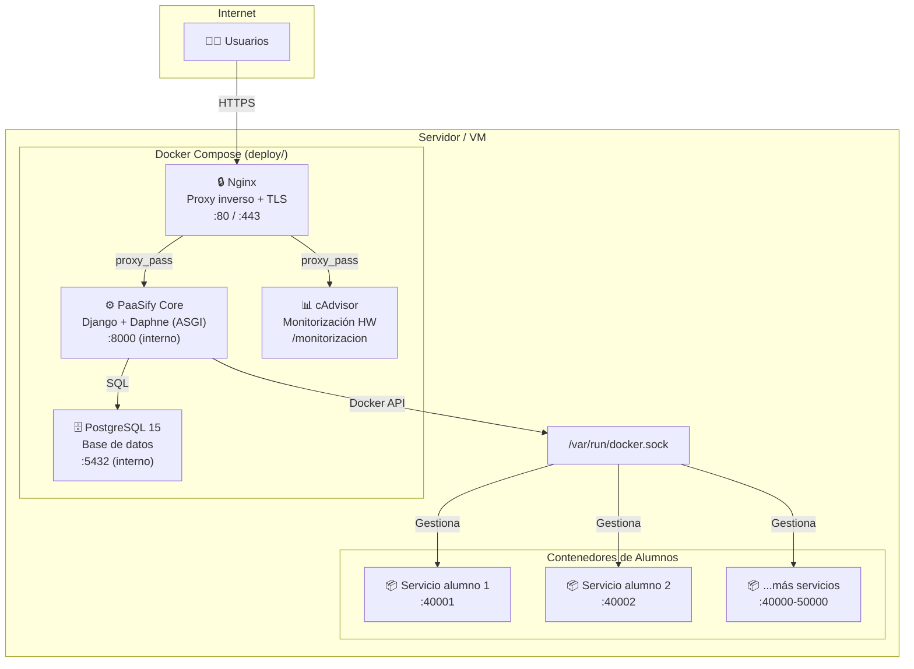

# 🚀 Guía de Despliegue y Administración — PaaSify

## Índice

1. [Requisitos del Sistema](#1-requisitos-del-sistema)
2. [Despliegue Rápido (Producción)](#2-despliegue-rápido-producción)
3. [Arquitectura de Producción](#3-arquitectura-de-producción)
4. [Configuración de Variables de Entorno](#4-configuración-de-variables-de-entorno)
5. [Certificados TLS y Seguridad](#5-certificados-tls-y-seguridad)
6. [Monitorización (cAdvisor)](#6-monitorización-cadvisor)
7. [Administración del Día a Día](#7-administración-del-día-a-día)
8. [Mantenimiento y Backups](#8-mantenimiento-y-backups)
9. [Resolución de Problemas](#9-resolución-de-problemas)

---

## 1. Requisitos del Sistema

| Componente            | Versión Mínima             | Notas                                                       |
| --------------------- | -------------------------- | ----------------------------------------------------------- |
| **Docker**            | 20.10+                     | Requerido en la máquina host                                |
| **Docker Compose**    | v2.12+                     | Plugin de Docker CLI                                        |
| **Sistema Operativo** | Ubuntu 22.04+ / Debian 12+ | Recomendado Linux para producción                           |
| **RAM**               | 4 GB mínimo                | 8 GB recomendado según número de alumnos                    |
| **Disco**             | 20 GB libres               | Las imágenes Docker de alumnos consumirán espacio adicional |
| **Red**               | Puerto 80 y 443 abiertos   | + rango 40000-50000 para servicios de alumnos               |

> **Nota:** PaaSify **NO necesita Python ni pip en la máquina de producción**. Todo el runtime se ejecuta dentro de un contenedor Docker.

---

## 2. Despliegue Rápido (Producción)

El despliegue usa **Sparse Checkout** para descargar solo la carpeta `deploy/` del repositorio (la imagen de la aplicación se descarga desde DockerHub):

```bash
# 1. Clonar solo la configuración de deploy
mkdir Paasify && cd Paasify
git clone --no-checkout --sparse https://github.com/DavidRG25/TFG_APP_DOCKER-PASSIFY.git .
git sparse-checkout set deploy
git checkout main

# 2. Preparar entorno
cd deploy
cp .env.example .env
nano .env  # Configura DJANGO_SECRET_KEY, credenciales BD, etc.

# 3. (Opcional) Configurar certificados TLS
# Copia tus certificados a deploy/nginx/certs/

# 4. Levantar todo el ecosistema
docker compose up -d
```

**Resultado:** En menos de 5 minutos tendrás PaaSify, PostgreSQL, Nginx (con TLS) y cAdvisor ejecutándose.

---

## 3. Arquitectura de Producción

PaaSify en producción se compone de **4 servicios orquestados** que se levantan con un solo `docker compose up -d`:



### Docker-outside-of-Docker (DooD)

PaaSify **no ejecuta Docker dentro de Docker**. En su lugar, monta el socket del host (`/var/run/docker.sock`) para crear contenedores "hermanos" directamente en la máquina anfitriona. Esto proporciona:

- **Rendimiento nativo:** los contenedores de alumnos no tienen overhead de virtualización adicional.
- **Acceso a puertos reales:** cada servicio de alumno es accesible por un puerto del host (rango 40000-50000).
- **Gestión centralizada:** PaaSify puede arrancar, parar, inspeccionar y eliminar contenedores directamente.

---

## 4. Configuración de Variables de Entorno

El archivo `.env` dentro de `deploy/` configura **todos** los servicios. Variables principales:

| Variable               | Requerida   | Descripción                                                                                                                                            |
| ---------------------- | ----------- | ------------------------------------------------------------------------------------------------------------------------------------------------------ |
| `DJANGO_SECRET_KEY`    | ✅          | Clave secreta criptográfica. Generar con: `python -c "from django.core.management.utils import get_random_secret_key; print(get_random_secret_key())"` |
| `DJANGO_DEBUG`         | ✅          | **Siempre `False`** en producción                                                                                                                      |
| `DJANGO_ALLOWED_HOSTS` | ✅          | Dominio del servidor (ej: `paas.tfg.etsii.urjc.es`)                                                                                                    |
| `DB_NAME`              | ✅          | Nombre de la base de datos PostgreSQL                                                                                                                  |
| `DB_USER`              | ✅          | Usuario de PostgreSQL                                                                                                                                  |
| `DB_PASSWORD`          | ✅          | Contraseña de PostgreSQL                                                                                                                               |
| `DB_HOST`              | ✅          | `db` (nombre del servicio en compose)                                                                                                                  |
| `DB_PORT`              | ✅          | `5432`                                                                                                                                                 |
| `PAASIFY_BASE_URL`     | Recomendada | URL base pública (ej: `https://paas.tfg.etsii.urjc.es`)                                                                                                |

---

## 5. Certificados TLS y Seguridad

Para HTTPS, coloca los certificados en `deploy/nginx/certs/`:

```
deploy/nginx/certs/
├── server.crt      # Certificado del servidor
└── server.key      # Clave privada
```

La configuración de Nginx ya referencia estos ficheros automáticamente.

---

## 6. Monitorización (cAdvisor)

PaaSify incluye **cAdvisor** para monitorizar los recursos de hardware de todos los contenedores:

- **URL:** `https://<tu-dominio>/monitorizacion`
- **Protegido** por contraseña HTTP Basic (configurar con `htpasswd`)
- Muestra CPU, RAM, red y disco por contenedor en tiempo real

```bash
# Generar contraseña para cAdvisor
cd deploy/nginx/htpasswd/
htpasswd -c .htpasswd admin
```

---

## 7. Administración del Día a Día

### Primer inicio — Crear datos base

Al levantar PaaSify por primera vez, ejecuta los comandos de inicialización **dentro del contenedor**:

```bash
# Entrar al contenedor de PaaSify
docker compose exec paasify bash

# Crear usuarios de demostración
python manage.py create_demo_users

# Poblar catálogo de imágenes Docker
python manage.py populate_example_images
```

### Gestión de usuarios

| Acción              | Cómo                                                                  |
| ------------------- | --------------------------------------------------------------------- |
| Crear admin         | `python manage.py createsuperuser` (dentro del contenedor)            |
| Crear alumnos       | Desde el panel de admin → Perfiles de alumnos → Añadir                |
| Crear profesores    | Desde el panel de admin → Perfiles de profesores → Añadir             |
| Resetear contraseña | Desde el panel de admin → Usuarios → Seleccionar → Cambiar contraseña |

### Ver logs

```bash
# Logs de PaaSify
docker compose logs -f paasify

# Logs de todos los servicios
docker compose logs -f

# Logs de un contenedor de alumno específico
docker logs <container_id>
```

---

## 8. Mantenimiento y Backups

### Backup de la base de datos

```bash
# Crear backup
docker compose exec db pg_dump -U ${DB_USER} ${DB_NAME} > backup_$(date +%Y%m%d).sql

# Restaurar backup
cat backup_20260305.sql | docker compose exec -T db psql -U ${DB_USER} ${DB_NAME}
```

### Limpiar archivos huérfanos

```bash
docker compose exec paasify python manage.py cleanup_media --dry-run  # Previsualizar
docker compose exec paasify python manage.py cleanup_media            # Ejecutar
```

### Actualizar PaaSify

```bash
cd deploy
docker compose pull paasify   # Descargar nueva versión
docker compose up -d paasify  # Reiniciar solo PaaSify
```

---

## 9. Resolución de Problemas

| Problema                                | Solución                                                                                      |
| --------------------------------------- | --------------------------------------------------------------------------------------------- |
| Los contenedores de alumnos no arrancan | Verificar que `/var/run/docker.sock` está montado y es accesible                              |
| Error de puerto en uso                  | Un servicio previo puede haber dejado un puerto reservado. Revisar `PortReservation` en admin |
| Archivos estáticos no cargan            | Ejecutar `docker compose exec paasify python manage.py collectstatic --noinput`               |
| Base de datos no arranca                | Verificar permisos de la carpeta `deploy/volumes/db_data/`                                    |
| WebSocket no funciona                   | Verificar que Nginx tiene configurado `proxy_set_header Upgrade` y `Connection`               |
