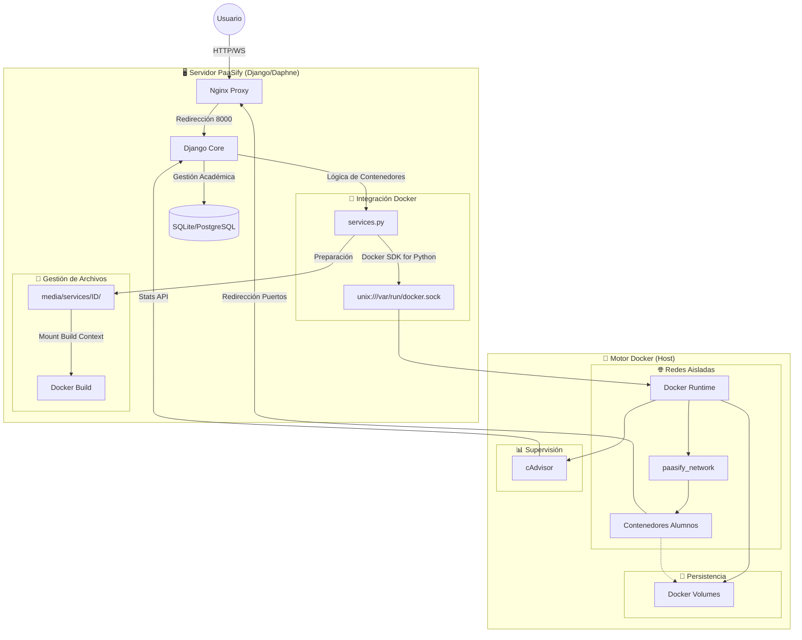
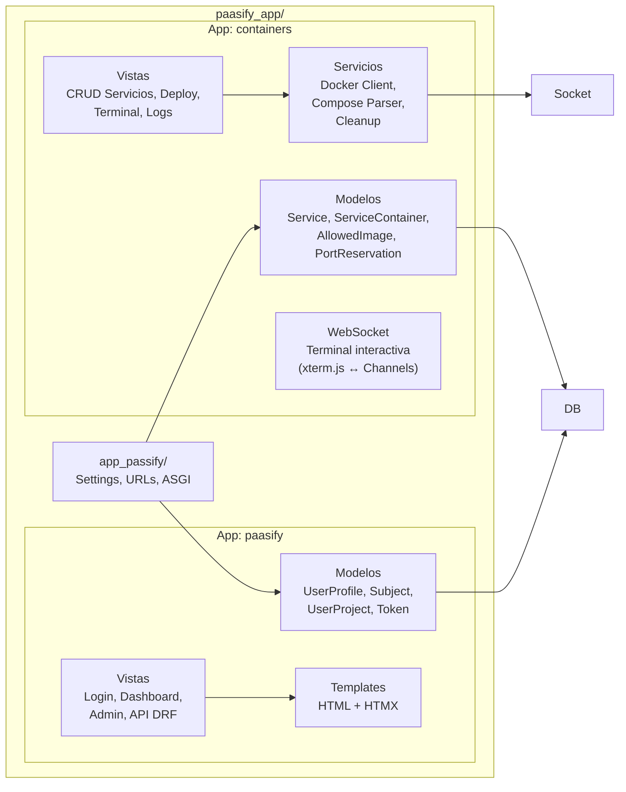
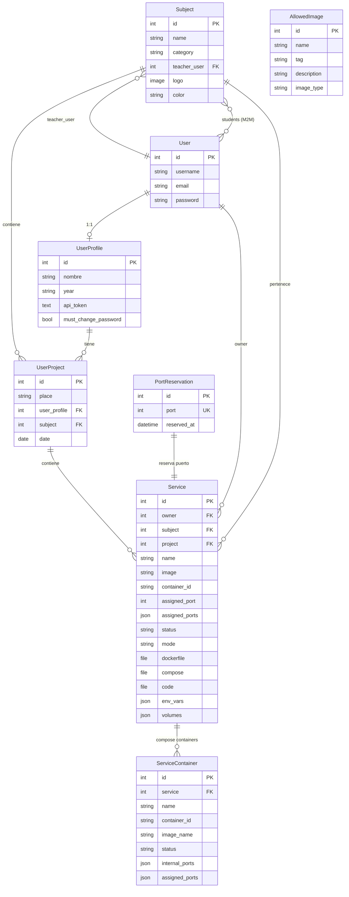
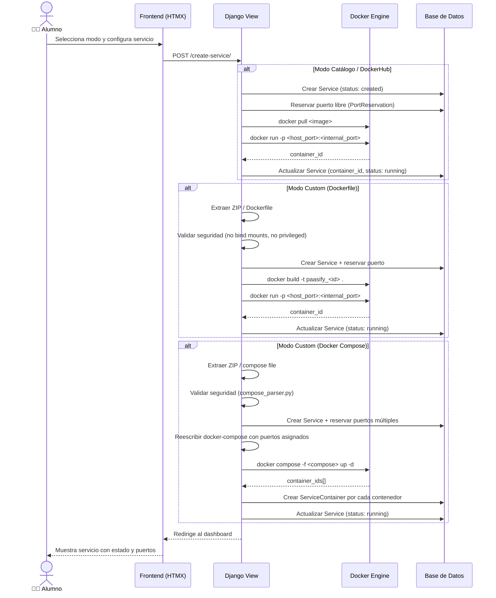

# 🛠 Guía de Desarrollo — PaaSify

## Índice

1. [Stack Tecnológico](#1-stack-tecnológico)
2. [Arquitectura de la Aplicación](#2-arquitectura-de-la-aplicación)
3. [Modelo de Datos](#3-modelo-de-datos)
4. [Estructura del Código](#4-estructura-del-código)
5. [Flujo de Despliegue de un Servicio](#5-flujo-de-despliegue-de-un-servicio)
6. [API REST](#6-api-rest)
7. [Entorno de Desarrollo Local](#7-entorno-de-desarrollo-local)
8. [Testing](#8-testing)
9. [CI/CD](#9-cicd)
10. [Convenciones del Proyecto](#10-convenciones-del-proyecto)

---

## 1. Stack Tecnológico

### Backend

| Tecnología                | Versión | Rol                             |
| ------------------------- | ------- | ------------------------------- |
| **Python**                | 3.10+   | Lenguaje principal              |
| **Django**                | 4.x     | Framework web                   |
| **Django REST Framework** | 3.x     | API REST                        |
| **drf-spectacular**       | —       | Documentación OpenAPI/Swagger   |
| **Django Channels**       | 4.x     | Soporte WebSocket (ASGI)        |
| **Daphne**                | —       | Servidor ASGI para producción   |
| **Docker SDK for Python** | —       | Interacción con el motor Docker |
| **PyJWT**                 | —       | Autenticación por tokens JWT    |
| **PyYAML**                | —       | Parseo de `docker-compose.yml`  |

### Frontend

| Tecnología           | Rol                                                                                    |
| -------------------- | -------------------------------------------------------------------------------------- |
| **Django Templates** | Renderizado de HTML en servidor                                                        |
| **HTMX**             | Interacciones dinámicas sin JS explícito (polling, modales, actualizaciones parciales) |
| **Bootstrap 5**      | Framework CSS responsivo                                                               |
| **xterm.js**         | Emulación de terminal web (WebSocket)                                                  |
| **Prism.js**         | Resaltado de sintaxis en logs y archivos                                               |

### Base de Datos (Híbrida)

| Motor             | Uso                                                    |
| ----------------- | ------------------------------------------------------ |
| **SQLite**        | Desarrollo local (con optimizaciones WAL + throttling) |
| **PostgreSQL 15** | Producción (alta concurrencia)                         |

> La detección es automática: si `DB_NAME` está vacío en `.env`, usa SQLite; si tiene valor, conecta a PostgreSQL.

### Infraestructura

| Componente         | Rol                                                    |
| ------------------ | ------------------------------------------------------ |
| **Docker**         | Contenedorización de servicios de alumnos              |
| **Docker Compose** | Orquestación multicontenedor                           |
| **Nginx**          | Proxy inverso + TLS en producción                      |
| **cAdvisor**       | Monitorización de recursos por contenedor              |
| **GitHub Actions** | CI/CD (tests automáticos + validación de Docker build) |

---

## 2. Arquitectura de la Aplicación

### 🌐 Funcionamiento Global y Tecnologías Docker

Este diagrama detalla cómo se integra el ecosistema PaaSify con el motor de Docker y cómo fluye la información:



### Lógica de Componentes

PaaSify sigue una arquitectura **monolítica modular Django** con dos apps principales:



### Apps Django

| App               | Responsabilidad                                                                                                                                                                                       |
| ----------------- | ----------------------------------------------------------------------------------------------------------------------------------------------------------------------------------------------------- |
| **`paasify`**     | Gestión académica: usuarios (UserProfile), asignaturas (Subject), proyectos (UserProject), autenticación JWT, dashboard, panel de administración                                                      |
| **`containers`**  | Gestión de contenedores: servicios Docker (Service), contenedores Compose (ServiceContainer), catálogo de imágenes (AllowedImage), reserva de puertos (PortReservation), terminal WebSocket, API REST |
| **`app_passify`** | Configuración Django (settings, URLs, ASGI/WSGI)                                                                                                                                                      |

---

## 3. Modelo de Datos



---

## 4. Estructura del Código

```
paasify_app/
├── app_passify/            # Configuración central Django
│   ├── settings.py         # Settings (DB híbrida, ASGI, seguridad)
│   ├── urls.py             # URL raíz (admin, API, Swagger)
│   └── asgi.py / wsgi.py   # Puntos de entrada
│
├── paasify/                # App: Gestión académica
│   ├── models/             # UserProfile, Subject, UserProject
│   ├── views/              # Login, Dashboard, Admin
│   ├── api_views.py        # ViewSets DRF
│   ├── api_serializers.py  # Serializers DRF
│   └── admin.py            # Configuración admin personalizada
│
├── containers/             # App: Gestión de contenedores
│   ├── models.py           # Service, ServiceContainer, AllowedImage, PortReservation
│   ├── views.py            # CRUD servicios, deploy, logs
│   ├── services.py         # Lógica Docker (arrancar, parar, limpiar)
│   ├── compose_parser.py   # Parse y validación de docker-compose.yml
│   ├── docker_client.py    # Inicialización cliente Docker
│   ├── consumers.py        # WebSocket consumer (terminal)
│   ├── routing.py          # Routing WebSocket
│   ├── serializers.py      # Validación de seguridad (compose)
│   ├── api_serializers.py  # Serializers API REST
│   └── forms.py            # Formularios de servicios
│
├── templates/              # Templates HTML (Django + HTMX)
│   ├── base.html           # Layout base
│   ├── containers/         # Templates de servicios
│   ├── dashboard/          # Dashboard del alumno
│   └── admin_custom/       # Panel admin personalizado
│
├── scripts/                # Scripts de utilidad
│   ├── run.sh              # Arranque rápido del servidor
│   ├── start.sh            # Inicialización completa (primera vez)
│   └── build_and_push.sh   # Build y push de imagen a DockerHub
│
├── security/               # Configuración de seguridad
├── testing_examples/       # Dockerfiles y Compose de ejemplo para testing
├── manage.py               # CLI Django
├── requirements.txt        # Dependencias Python
└── Dockerfile              # Imagen de producción
```

---

## 5. Flujo de Despliegue de un Servicio

Cuando un alumno crea un servicio, el sistema ejecuta este flujo:



---

## 6. API REST

PaaSify expone una API REST completa autenticada via **Bearer Token (JWT)**:

| Endpoint                      | Métodos            | Descripción                          |
| ----------------------------- | ------------------ | ------------------------------------ |
| `/api/containers/`            | GET, POST          | Listar / crear servicios             |
| `/api/containers/<id>/`       | GET, PATCH, DELETE | Detalle / editar / eliminar servicio |
| `/api/containers/<id>/start/` | POST               | Arrancar servicio                    |
| `/api/containers/<id>/stop/`  | POST               | Parar servicio                       |
| `/api/subjects/`              | GET                | Listar asignaturas                   |
| `/api/projects/`              | GET                | Listar proyectos                     |
| `/api-docs/`                  | GET                | Documentación Swagger/OpenAPI        |

### Autenticación

```bash
curl -X GET http://localhost:8000/api/containers/ \
  -H "Authorization: Bearer <JWT_TOKEN>"
```

El token se genera desde **Mi Perfil → Generar Token** en la interfaz web.

---

## 7. Entorno de Desarrollo Local

### Quickstart

```bash
cd paasify_app

# Primera vez (crea venv, instala deps, configura BD, crea usuarios demo)
bash start.sh

# Desarrollo diario
bash run.sh
```

### Requisitos locales

- Python 3.10+
- Docker Desktop (ejecutándose)
- Git

### Variables de entorno (desarrollo)

Copia `.env.example` a `.env` dentro de `paasify_app/`:

```bash
cp .env.example .env
```

En desarrollo, con `DJANGO_DEBUG=True` y `DB_NAME` vacío, PaaSify usará SQLite automáticamente.

---

## 8. Testing

```bash
cd paasify_app

# Tests Django
python manage.py test

# Tests con coverage (si está instalado)
coverage run manage.py test
coverage report
```

### Ejemplos de servicios para testing manual

En `paasify_app/testing_examples/` hay Dockerfiles y Compose files listos para probar:

| Ejemplo                   | Tipo       | Descripción                      |
| ------------------------- | ---------- | -------------------------------- |
| `02_dockerfile_flask_api` | Dockerfile | Flask con dashboard Tailwind     |
| `02_compose_redis_nginx`  | Compose    | Nginx + Redis                    |
| `04_compose_mega_stack`   | Compose    | Gateway + API + Redis + Postgres |

---

## 9. CI/CD

GitHub Actions ejecuta automáticamente en cada push/PR a `main` o `develop`:

1. **Test:** Instala dependencias, levanta PostgreSQL de test, ejecuta `python manage.py test`.
2. **Docker Build Check:** Verifica que `docker build ./paasify_app` compila sin errores.

El workflow está en `.github/workflows/django_test.yml`.

### Build & Push manual

```bash
cd paasify_app
bash scripts/build_and_push.sh
```

Requiere configurar `.docker_credentials` con `DOCKER_USER` y `DOCKER_PASS`.

---

## 10. Convenciones del Proyecto

| Aspecto                  | Convención                                                    |
| ------------------------ | ------------------------------------------------------------- |
| **Idioma del código**    | Inglés para código, español para documentación y UI           |
| **Estilos**              | Bootstrap 5 + CSS custom                                      |
| **Interactividad**       | HTMX preferido sobre JavaScript vanilla                       |
| **Autenticación API**    | Bearer Token JWT (generado desde perfil de usuario)           |
| **Puertos de alumnos**   | Rango 40000-50000, reservados atómicamente en BD              |
| **Archivos de servicio** | Centralizados en `media/services/<service_id>/`               |
| **Limpieza**             | Signal `pre_delete` en Service → limpia contenedor + archivos |
| **Seguridad Compose**    | Bloqueo de `privileged`, `bind mounts`, `network_mode: host`  |
