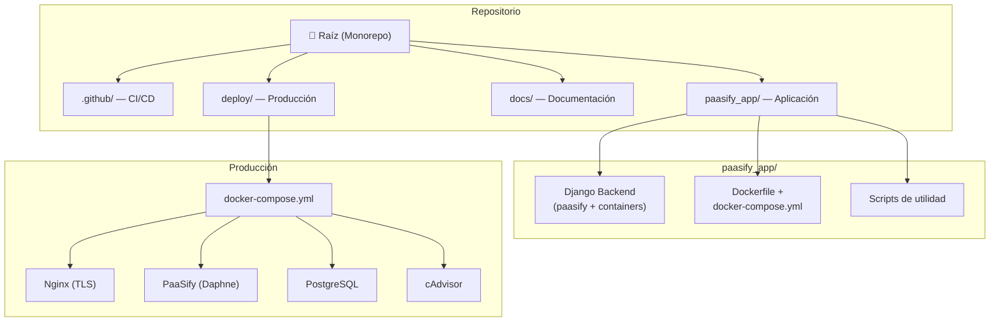

# 📖 Documentación de PaaSify

  

  <em>Plataforma como Servicio (PaaS) educativa para despliegue de contenedores Docker</em>

---

## Guías Disponibles

| Documento                                           | Audiencia                    | Descripción                                                                                                                     |
| --------------------------------------------------- | ---------------------------- | ------------------------------------------------------------------------------------------------------------------------------- |
| [**🚀 Despliegue y Administración**](DEPLOYMENT.md) | Sysadmins / DevOps           | Cómo desplegar PaaSify en producción, configurar TLS, monitorizar con cAdvisor, hacer backups y resolver problemas              |
| [**🛠 Desarrollo**](DEVELOPMENT.md)                 | Desarrolladores              | Stack tecnológico, arquitectura interna (con diagramas), modelo de datos, estructura del código, API REST, CI/CD y convenciones |
| [**📘 Guía de Usuario**](USER_GUIDE.md)             | Alumnos / Profesores / Admin | Qué es PaaSify, cómo desplegar servicios, roles, terminal web, API programática y preguntas frecuentes                          |

---

## Resumen de la Arquitectura

---

## Enlaces Rápidos

- **Código fuente:** [`paasify_app/`](../paasify_app/)
- **CI/CD:** [`.github/workflows/`](../.github/workflows/)
- **Configuración de producción:** [`deploy/`](../deploy/)
- **API interactiva:** `/api-docs/` (disponible en la instancia desplegada)
