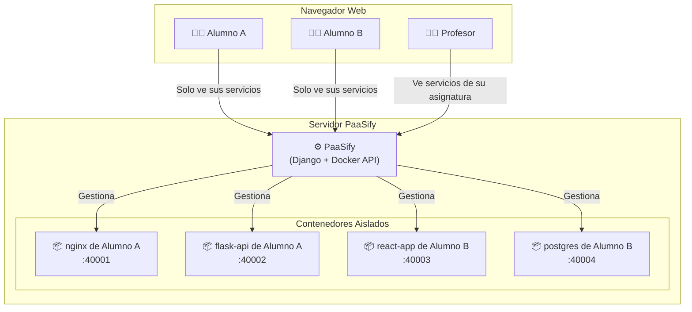
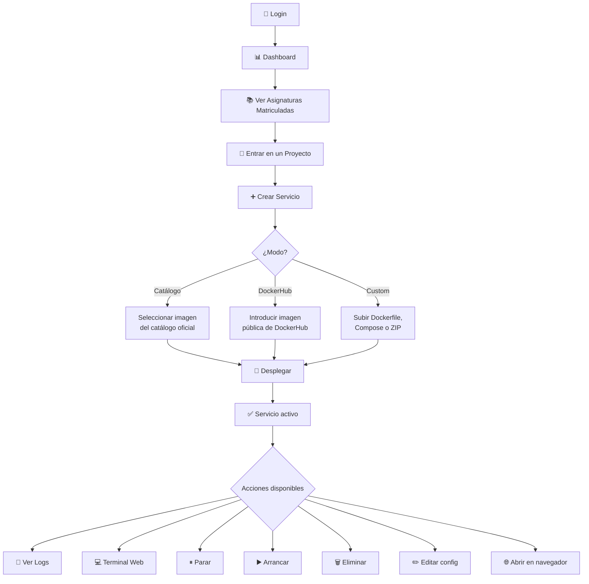
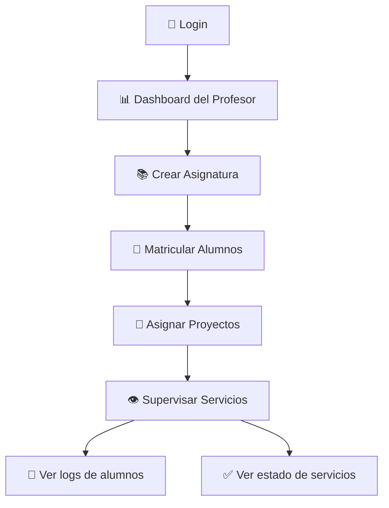

# 📘 Guía de Usuario — PaaSify

## Índice

1. [¿Qué es PaaSify?](#1-qué-es-paasify)
2. [Arquitectura y Modelo de Ejecución](#2-arquitectura-y-modelo-de-ejecución)
3. [Roles de Usuario](#3-roles-de-usuario)
4. [Flujo del Alumno](#4-flujo-del-alumno)
5. [Modos de Despliegue](#5-modos-de-despliegue)
6. [Terminal Web Interactiva](#6-terminal-web-interactiva)
7. [API Programática](#7-api-programática)
8. [Flujo del Profesor](#8-flujo-del-profesor)
9. [Panel de Administración](#9-panel-de-administración)
10. [Preguntas Frecuentes](#10-preguntas-frecuentes)

---

## 1. ¿Qué es PaaSify?

**PaaSify** es una **Plataforma como Servicio (PaaS)** diseñada para entornos educativos universitarios. Permite a los **alumnos** desplegar aplicaciones en contenedores Docker desde una interfaz web intuitiva, sin necesidad de acceder a servidores ni usar línea de comandos.

### ¿Para qué sirve?

- Que los alumnos practiquen despliegues reales de aplicaciones web, APIs, bases de datos y entornos multicontenedor.
- Que los profesores organicen el trabajo por asignaturas y proyectos, con visibilidad sobre los servicios desplegados.
- Que el administrador gestione usuarios, cuotas y la salud general de la plataforma.

### ¿Qué tipo de PaaS es?

| Característica   | Descripción                                                                                               |
| ---------------- | --------------------------------------------------------------------------------------------------------- |
| **Tipo**         | PaaS local (self-hosted), **single-node**                                                                 |
| **Ejecución**    | Todos los contenedores se ejecutan en una **única máquina** (servidor/VM)                                 |
| **Motor**        | Docker Engine (los servicios son contenedores Docker reales)                                              |
| **Red**          | Cada servicio recibe un **puerto único** del host (rango 40000-50000)                                     |
| **Aislamiento**  | Cada contenedor se ejecuta de forma **aislada** a nivel de proceso, red y filesystem                      |
| **Multi-tenant** | Varios alumnos comparten la misma infraestructura, pero cada uno solo ve y gestiona sus propios servicios |

---

## 2. Arquitectura y Modelo de Ejecución



### ¿Cómo se aíslan los usuarios?

1. **Aislamiento lógico (BD):** Cada servicio tiene un `owner`. Los alumnos solo ven los servicios de sus proyectos asignados.
2. **Aislamiento de contenedor (Docker):** Cada servicio es un contenedor Docker independiente con su propio filesystem, red y procesos.
3. **Aislamiento de puertos:** Cada servicio recibe un puerto único del rango 40000-50000. Un alumno no puede acceder a los puertos de otro alumno desde la interfaz (aunque los puertos son técnicamente accesibles en la red del host).
4. **Seguridad en archivos de orquestación:** PaaSify valida y prohíbe configuraciones peligrosas en los `docker-compose.yml` subidos:
   - ❌ `privileged: true` → Bloqueado
   - ❌ `bind mounts` al host (`/var/run/`, `/etc/`) → Bloqueado
   - ❌ `network_mode: host` → Bloqueado
   - ❌ Variables sospechosas (`DOCKER_HOST`, etc.) → Bloqueado

---

## 3. Roles de Usuario

PaaSify tiene **3 roles** con permisos diferenciados:

| Rol                       | Puede...                                                                         | No puede...                                                           |
| ------------------------- | -------------------------------------------------------------------------------- | --------------------------------------------------------------------- |
| **🎓 Alumno (Student)**   | Desplegar servicios en sus proyectos, ver logs, usar terminal, acceder a API     | Ver servicios de otros alumnos, crear asignaturas, gestionar usuarios |
| **👨‍🏫 Profesor (Teacher)** | Crear asignaturas, asignar proyectos a alumnos, ver servicios de su asignatura   | Modificar servicios de alumnos, acceder al panel admin                |
| **🔧 Admin**              | Todo lo anterior + gestionar usuarios, imágenes del catálogo, ver monitorización | —                                                                     |

---

## 4. Flujo del Alumno



### ¿Qué ve el alumno?

1. **Dashboard:** Vista general con todas las asignaturas en las que está matriculado.
2. **Asignatura:** Lista de proyectos asignados dentro de esa asignatura.
3. **Proyecto:** Lista de servicios desplegados + botón para crear nuevos.
4. **Servicio:** Tarjeta con estado (running/stopped), puertos, logs, terminal y acciones.

---

## 5. Modos de Despliegue

PaaSify ofrece **3 modos** para desplegar servicios:

### 5.1. Catálogo Oficial

Selecciona una imagen del catálogo pre-aprobado por el administrador (nginx, postgres, python, node, etc.).

- **Ideal para:** Pruebas rápidas, bases de datos, servicios estándar.
- **Configuración:** Solo nombre del servicio y puerto interno (opcional).

### 5.2. DockerHub

Introduce cualquier imagen pública de Docker Hub (ej: `python:3.11`, `mongo:7`, `grafana/grafana`).

- **Ideal para:** Imágenes especializadas no incluidas en el catálogo.
- **Configuración:** Nombre del servicio, imagen y puerto interno.

### 5.3. Custom (Personalizado)

Sube tu propio código. PaaSify soporta 3 formatos:

| Formato                | Qué subir                                      | Resultado                                |
| ---------------------- | ---------------------------------------------- | ---------------------------------------- |
| **Dockerfile**         | Archivo Dockerfile (+ ZIP con código opcional) | Un contenedor construido desde tu código |
| **docker-compose.yml** | Archivo Compose (+ ZIP con contexto)           | Múltiples contenedores orquestados       |
| **ZIP completo**       | ZIP con Dockerfile o Compose en la raíz        | PaaSify detecta automáticamente el tipo  |

- **Ideal para:** Proyectos propios, aplicaciones con múltiples servicios.

---

## 6. Terminal Web Interactiva

PaaSify incluye una terminal web basada en **xterm.js** que permite ejecutar comandos directamente dentro de cualquier contenedor:

- Accesible desde la vista del servicio → botón **"Terminal"**
- Soporta contenedores simples y contenedores individuales de un entorno Compose
- Conexión vía WebSocket (tiempo real)
- Funciona en cualquier navegador moderno

---

## 7. API Programática

PaaSify expone una API REST que permite gestionar servicios de forma programática (ideal para CI/CD, scripts o integración con GitHub Actions):

### Obtener tu token

1. Inicia sesión en PaaSify
2. Ve a **Mi Perfil**
3. Haz clic en **"Generar Token"**

### Ejemplo: Listar tus servicios

```bash
curl -X GET https://paasify.example.com/api/containers/ \
  -H "Authorization: Bearer TU_TOKEN"
```

### Ejemplo: Crear un servicio

```bash
curl -X POST https://paasify.example.com/api/containers/ \
  -H "Authorization: Bearer TU_TOKEN" \
  -H "Content-Type: application/json" \
  -d '{
    "name": "mi-api",
    "image": "python:3.11",
    "internal_port": 5000,
    "mode": "dockerhub",
    "project": 1,
    "subject": 1
  }'
```

### Documentación completa

Accede a `https://paasify.example.com/api-docs/` para ver la documentación OpenAPI/Swagger interactiva.

---

## 8. Flujo del Profesor



### Capacidades del profesor

- **Crear asignaturas** con logo y color personalizados
- **Matricular alumnos** a las asignaturas (individualmente o en lote)
- **Crear proyectos** y asignarlos a alumnos
- **Supervisar** los servicios desplegados por los alumnos de su asignatura
- **Acceder a la documentación API** para integraciones

---

## 9. Panel de Administración

El administrador tiene acceso a `/admin/` con un panel Django personalizado:

| Sección                 | Funciones                                                         |
| ----------------------- | ----------------------------------------------------------------- |
| **Usuarios**            | Crear, editar, eliminar usuarios. Asignar roles (Student/Teacher) |
| **Perfiles**            | Gestionar perfiles de alumnos y profesores                        |
| **Asignaturas**         | CRUD completo de asignaturas                                      |
| **Proyectos**           | Gestión de proyectos asignados                                    |
| **Servicios**           | Ver y gestionar todos los servicios de la plataforma              |
| **Imágenes permitidas** | Gestionar el catálogo de imágenes Docker disponible               |
| **Reservas de puerto**  | Ver puertos reservados y liberar manualmente si es necesario      |

---

## 10. Preguntas Frecuentes

### ¿Es PaaSify un sistema distribuido?

**No.** PaaSify es un PaaS **single-node**. Todos los contenedores se ejecutan en una única máquina. Esto simplifica enormemente la administración y es más que suficiente para un entorno educativo con decenas de alumnos.

### ¿Cuántos servicios soporta simultáneamente?

El límite principal es el número de **puertos disponibles** (rango 40000-50000 = hasta 10.000 servicios) y la **RAM/CPU** del servidor. En un servidor con 16 GB de RAM se pueden ejecutar cómodamente 50-100 servicios simultáneos dependiendo de su consumo.

### ¿Qué pasa si un alumno despliega algo malicioso?

PaaSify aplica validación estricta a los archivos subidos:

- Bloqueo de modo privilegiado
- Bloqueo de bind mounts al host
- Bloqueo de network_mode: host
- Los contenedores no tienen acceso al socket Docker del host

Además, cada contenedor está aislado por Docker. Si un servicio consume demasiados recursos, el administrador puede detenerlo o eliminarlo desde el panel admin.

### ¿Se puede acceder a los servicios desde fuera del servidor?

Sí. Cada servicio se expone en un puerto del host. Si el servidor es accesible desde Internet o la red de la universidad, los servicios son accesibles en `http://<ip_servidor>:<puerto_asignado>`.

### ¿Los datos de los servicios persisten al reiniciar?

Los contenedores Docker son **efímeros** por defecto: al eliminar un servicio, se pierden los datos. Sin embargo, PaaSify soporta volúmenes Docker para persistencia si se configuran en el `docker-compose.yml`.
